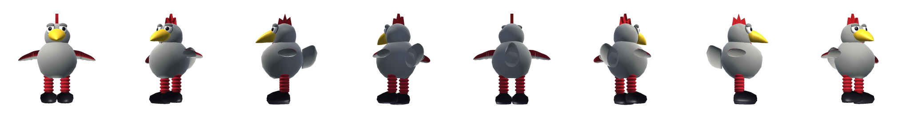

# Mr. Cluckers

A procedurally generated 3D model of a plush rooster dog toy, rigged with
floppy secondary motion and baked into sprite sheets for a 2D platformer.



Everything here is generated from source by one script. There are no binary
model files to hand-edit, no third-party dependencies, and no build tools —
just Python 3.

```
python3 build.py
```

## What gets built

| Path | What it is |
| --- | --- |
| `assets/model/mrcluckers.glb` | The 3D model with all 12 animation clips. Drop into Blender, Godot, Unity or three.js. |
| `assets/model/ginger.glb` | Ginger, the dog he is trying to reach, with five clips. |
| `assets/model/mrcluckers.gltf` | Same thing as text-plus-data-URI, if you want to read it. |
| `assets/model/mrcluckers.obj` + `.mtl` | Static rest pose for tools that prefer OBJ. |
| `assets/sprites/mrcluckers_side.png` | The sprite sheet: one row per animation. |
| `assets/sprites/mrcluckers_side.json` | Frame rectangles, timings, and the foot anchor. |
| `assets/sprites/mrcluckers_side.js` | The same data as a `<script>` tag, for `file://` demos. |
| `assets/sprites/ginger_side.png` + `.json` | Ginger's sheet, baked at the same pixels-per-unit so the two are to scale. |
| `assets/textures/*.png` | Tiling fabric maps: base colour and normals for fur, corduroy and felt. |
| `assets/reference/turnaround.png` | Eight-angle turnaround for reference. |
| `shared/controls.js` | On-screen controls for touch devices, used by both demos. |
| `shared/jump.js` | The movement budget — the numbers that decide what a level can ask. |
| `shared/level.js` | Level format, and the conversion the canvas demo needs. |
| `shared/bonus.js` | The bonus round's rules and physics, with no rendering. |
| `shared/patrol.js` | Machines that move along a surface — where they are, and what they do to you. |
| `shared/checkpoint.js` | Where he comes back to after a fall. |
| `levels/*.json` | The levels themselves. `levels.js` is the generated bundle. |

## Two demos

Both play the same way: arrow keys move, <kbd>Space</kbd> jumps,
<kbd>&darr;</kbd> crouches, <kbd>X</kbd> pecks, <kbd>C</kbd> crows,
<kbd>Z</kbd> squeaks, <kbd>V</kbd> tumbles.

Both work on a phone: on a touch device an on-screen pad appears, and the
play area reflows for the screen. Landscape gives the wider view a
side-scroller wants, but portrait is playable.

**`demo/index.html` — sprites on a 2D canvas.** Open it directly in a
browser, no server needed. `demo/game.js` is meant to be read as much as
played: `Anim` handles frame timing, `pickState` is the animation state
machine, and the draw call shows how to use the anchor so the sprite's feet
land on the floor.

**`web/index.html` — the live 3D model in three.js.** An orthographic camera
locked to the same side-on angle as the sprites, so it looks like the sheet
but animates continuously and lights dynamically. Needs a local server
because browsers block module and glTF loads over `file://`:

```
python3 -m http.server 8000     # then open localhost:8000/web/
```

`web/mrcluckers.js` is the reusable part — a small character API you can drop
into your own scene:

```js
import { Cluckers, sideCamera, plushLighting } from './mrcluckers.js';

const bird = await Cluckers.load('../assets/model/mrcluckers.glb');
scene.add(bird.root);
bird.play('run');          // cross-fades from whatever was playing
bird.setFacing(-1);        // turns rather than mirroring
bird.update(dt);           // in your loop
```

It handles cross-fade timing per state (impacts snap, ambient states ease),
sets the one-shot clips to hold their last frame, and fires `onFinished` so
your controller knows when `peck` or `land` is done.

## Animations

| Clip | Frames | Loops | For |
| --- | --- | --- | --- |
| `idle` | 16 | yes | standing around, breathing |
| `walk` | 8 | yes | slow movement |
| `run` | 8 | yes | full speed |
| `jump` | 4 | no | crouch, launch, rise |
| `fall` | 4 | yes | airborne, wings flapping |
| `land` | 4 | no | impact squash and recovery |
| `crouch` | 2 | no | ducking |
| `peck` | 6 | no | attack / interact |
| `crow` | 7 | no | taunt / victory |
| `hurt` | 3 | no | taking damage |
| `squeak` | 6 | no | the squeaker gag — crushed flat, pops back |
| `tumble` | 8 | yes | knocked across the room, everything flailing |

### How the demos treat actions

Actions are **cosmetic**: `peck`, `crow`, `squeak` and `tumble` never stop the
character. Movement follows the keys that are *held*, so firing one mid-run
keeps the run, and jumping works throughout.

| Rule | Why |
| --- | --- |
| An action ends when its clip finishes | the normal case |
| `tumble` also ends after 1.2s | it's the one clip that **loops** — a continuous spin — so it would otherwise never end |
| Jump ends any action | movement states outrank a flourish |
| A direction ends `tumble` only | it's a stun you shrug off; ending `peck` too would mean you could never peck on the run |
| Pressing the same key again ends it | and doesn't restart it |

If you wire `tumble` up yourself, give it a time limit. Don't make it a
one-shot clip instead — that caps it at exactly one turn forever.

## Designing levels

Levels live in `levels/*.json`, authored **once** and read by both demos and
the editor. Coordinates are world units — 1 unit is Mr. Cluckers' height —
with **Y up** and the ground's top surface at `y = 0`. A platform's `y` is its
top surface, the edge that matters for landing.

```json
{
  "name": "Living Room",
  "width": 33,
  "spawn": { "x": 1.5, "y": 0 },
  "goal":  { "x": 30.5, "y": 0 },
  "platforms": [ { "x": 4, "y": 1, "w": 2.5, "h": 0.5 } ],
  "pickups":   [ { "x": 5.25, "y": 1.6 } ],
  "hazards":   [ { "x": 10, "y": 0, "w": 2.5, "h": 0.4, "kind": "water" } ]
}
```

Open [`editor/`](editor/) to draw one. It snaps to a half-height grid and
draws **his real jump arc under the cursor**, so you can see what's reachable
before playtesting. It flags platforms nothing can reach and gaps within 15%
of the limit. Export the JSON, save it into `levels/`, then:

```
python3 build.py --only levels
```

That bundles every level into `levels/levels.js`, which the demos load with a
`<script>` tag — browsers block `fetch()` over `file://`, so a bundle is what
makes the demos work by double-clicking. Add `?level=the-garden` to either
demo to pick one.

### What a jump can do

Measured from the real physics in `shared/jump.js`, in character heights:

| | | measured in-game |
| --- | --- | --- |
| Max jump (hold) | **1.54** | 1.54 |
| Tap jump | 0.64 | |
| Gap at full run | **2.44** | 2.46 |
| Gap using coyote time | 2.72 | 2.97 |
| Gap at walk speed | 1.04 | |
| Onto a ledge +1.0 up | 1.98 | |
| Onto a ledge +1.5 up | 1.42 | |

The right-hand column is a binary search run against the real demo, driving
real key events, so the model is checked rather than trusted. It is accurate
to 0.02 on the flat, and deliberately conservative about coyote time.

**Design to 2.44, not 2.72.** Jumping *after* stepping off the ledge is worth
half a unit, and nothing in the game teaches it. A gap between the two numbers
is one only an experienced player will cross — `route()` reports those
separately as coyote-only.

Rules of thumb: **comfortable gap 1.6–1.8**, **comfortable step up ≤1.0**,
nothing more than 1.5 above the surface that has to reach it, and a landing
platform at least **1.6** wide — his collision box is only 0.44 across, but he
arrives carrying momentum, and a narrow target is as easy to overshoot as to
fall short. A 1.3-wide stepping stone on a descending hop was only landable
from three of eight take-off points.

Both demos derive their constants from `shared/jump.js`, so the editor's arc
is the arc you actually get.

### Checking a level

`Level.route()` walks the level the way a player has to — from the surface
under the spawn, across only the jumps he can make at the lip — and reports
whether the goal is on the far end, the **hardest jump you are forced to
make** as a fraction of the budget, any coyote-only gaps, stranded platforms
and uncollectable pickups. The editor shows all of it live.

That replaces `unreachable()`, which only ever asked whether *something* could
get to each platform. Both shipped levels passed it. One of them could be
completed by holding right for nine seconds; the other could not be completed
at all.

The two levels now sit at **86%** and **92%** of budget at their hardest
forced jump, with the peak in the middle of each — failing still costs you the
whole level, so the demanding jump should not be the last one.

## Checkpoints

Falling in water or down a gap used to put him back at the level's spawn, so a
mistake near the end cost the whole level. That shaped two earlier decisions:
both levels put their hardest jump in the *middle* rather than building to
one, and the vacuum had to be harmless, because a lethal obstacle plus a full
rewind is a lot to ask of a toy chicken.

**There is nothing to author.** He checkpoints wherever he is standing safely,
so a level gets this by existing — including the two that already shipped. A
level may still list `checkpoints` explicitly if it wants a guaranteed spot.

A spot counts when there is real ground under him with a clear unit either
side, and no water within reach. The margin is what stops him reappearing on a
lip and walking straight back off it.

### What is deliberately *not* excluded

The stretch a vacuum sweeps. Excluding it reads like the careful thing to do,
and it costs the entire middle of the living room — the patrols there span
nearly their whole floor section, so the level would checkpoint on one side of
its hardest jump and never after it. The vacuum cannot kill him, and the
grace period covers the arrival, so a machine trundling past a checkpoint is
fine.

Coming back grants 1.2 s of immunity, so you are not hit the moment you
arrive, and a ring plays at the arrival point so a respawn reads as something
happening rather than a teleport.

### The test that matters

A checkpoint that kills him again would be worse than the full reset it
replaced. So: stand him at **every** spot he can stand in both levels, kill
him, and check he comes back to solid ground and is still there a second
later. 70 spots, no traps.

Now that a mistake is cheap, the levels could escalate to their end rather
than peaking in the middle — that re-tune has not been done yet.

## The robot vacuum

Ginger is frightened of the robot vacuum, so one belongs in her living room.
The Garden doesn't get one — a Roomba outdoors would be silly, and it gives
the two levels different characters.

**It isn't lethal.** He's a plush toy, and a vacuum that catches him bats him
back down the room rather than ending his run. That's deliberate: falling in
water still costs the whole level, so anything that killed you would need
checkpoints before it was fair. A knockback needs nothing.

`shared/patrol.js` gives a patrol's position as a **pure function of time**
rather than integrated state, so the two demos can't drift apart and a test
can ask where a machine will be. It sweeps its span, pauses at each end — the
pause is what makes it readable, a moment to see which way it's about to go —
and turns around.

### Three things it took to make a shove feel like a shove

- **Friction scrubbed it off.** The knockback lasted about a tenth of a second
  and moved him a third of a unit, which read as nothing happening. Friction
  is now suspended while he's stunned, and a hit carries him about 2.3 units.
- **It bulldozed him.** Without a moment's immunity after a hit, it caught him
  again the instant the stun ended and pushed him along the floor — into a
  gap, which *is* fatal. There's a 0.75 s grace period now.
- **A shove near a ledge is a death.** Patrols keep `clearance` (1.6 units)
  from the ends of the surface they run on, so being hit can't be the thing
  that drops him.

### The counterplay

Being above it is safe, so you time the gap or jump it. Both are verified:
walking into it gets you hit, jumping past it clears it and lands you beyond.

## Touch controls

`shared/controls.js` mounts a d-pad, a jump button and the action buttons on
touch devices. Rather than giving each demo a second input path, the buttons
dispatch synthetic keyboard events, so the existing `keydown` / `keyup`
handlers pick them up unchanged.

Multi-touch does **not** come for free, which this file learned the hard way.
Every button carried a window-level `pointerup` fallback to clear it if a
thumb slid off — and that fallback did not check *which* pointer had ended,
so lifting any finger anywhere released every held button. Holding a
direction and tapping jump dropped the direction, which is the one thing two
thumbs are for. Each button now records the pointer that pressed it and
ignores the rest; only a `blur`, which has no pointer at all, still releases
unconditionally.

It only mounts where the *primary* pointer is coarse, so a laptop with a
touchscreen keeps its keyboard and its screen space. Add `?touch=1` to any
demo URL to force the pad on for testing.

```js
TouchControls.mount({ actions: [{ code: 'KeyX', label: 'peck' }] });
TouchControls.mount({ container: el, inline: true });  // flows, doesn't float
```

## Ginger

`tools/mc/ginger.py` builds the dog, from photographs, the same way — lofted
tubes along the spine and limbs rather than rigid parts, since a dog is not a
plush toy. She stands about 1.15 units at the shoulder against Mr. Cluckers'
1.0, so she is properly bigger than the toy.

Markings are painted onto faces by position rather than modelled — the white
blaze, chest bib, belly, socks and tail tip, and the dark mask around each
eye — with the boundaries jittered by noise so they read as fur rather than
decals. Because a face is painted whole, the boundary can only be as smooth
as the mesh, which is why her head is deliberately denser than her body.

The eyes are built as almond lenses — a superellipse with the corners pulled
out — stacked rim, iris, pupil and highlight, and seated on the skull surface
just behind the stop so they read from the front as well as in profile.

She waits at each level's goal — sitting until Mr. Cluckers arrives, then
`greet`, then wagging, and then she throws him. Both demos show her: the
canvas one from her sprite sheet, the three.js one from her glTF.

She is rigged and has five clips — `stand`, `wag`, `sit`, `sit_idle` and
`greet` — in `tools/mc/ginger_anim.py`. Her tail is three segments driven
through the same spring solver as Mr. Cluckers' comb, which is what turns a
keyframed sweep into a whip: the tip travels about twice as far as the
keyframes ask.

```
python3 build.py --only ginger
```

The sit poses were **solved numerically**, not eyeballed. Her front legs stay
straight and planted, the body offset is whatever keeps the front paw still
as the body pitches, and the hind angles are the ones that put the stifle
forward alongside her belly with the hock low behind it. Constraining only
the paw — the obvious thing — gave a dog whose knee stuck up behind her.

Reference notes worth keeping, since they were the corrections that mattered:
she is leggier than a pure Staffordshire, front legs about half her shoulder
height, deep-chested with a clear waist tuck, and her tail is long and
whip-like rather than stubby.

## The bonus round

Reaching her is not the end of the level. After the greeting she picks the toy
up and throws him, three times, and you steer him through the air to collect
treats — or bring him back down into the ring at her feet for a catch.

`shared/bonus.js` holds the whole thing: phases (`idle → wind → flight →
settle → done`), the throw physics, scoring, treat placement, and the two
measurements the demos frame the round from. It draws nothing. Both demos
create one instance and render it their own way, which is what keeps them
playing the same game rather than merely looking alike.

### The throw does not use the platformer's gravity

At 24 units/s² a throw worth steering peaks 3.7 units up and is over in
0.96 s. Nothing that tall fits a phone screen, and 0.96 s is not long enough
to read where the toy is going and do something about it. A tossed plush
hangs, so the round leans into that: gravity 7.0, a 1.24 s hang, peaking 2.3
units above her feet.

That is a deliberate departure from `shared/jump.js` rather than an oversight,
and it is the difference between a bonus round and a quick-time event.

### Two things that make it readable

A **landing marker** slides along the ground showing where the toy comes down
if you stop steering now, and the **catch zone** is drawn around her feet.
Both turn green when the one is inside the other. Without them you are
integrating acceleration in your head, which is exactly what made the first
version feel like guesswork.

In the three.js demo both stand *up* off the ground. A flat decal is the
obvious way to draw a landing zone and it is invisible there — that camera is
side-on and orthographic, so anything lying flat is edge-on.

### Treats are placed by the physics, not by hand

Each treat sits a fixed fraction of the way from the do-nothing arc to the
hardest steer in one direction, and is then checked against the *whole*
do-nothing path rather than the sample it came from. That second check
matters: near the apex the arc is horizontal, so a sideways offset there buys
no distance at all, and a treat placed by offset alone gets swept up by a
player who never touches the controls.

They sit near the full-steer path, so **holding a direction sweeps them up**.
Aiming, not modulating — an earlier version put them mid-envelope, where
collecting them needed input you cannot time on purpose.

### The choice

Which side the treats lead to alternates by throw:

| Line | Away throw | Toward throw |
| --- | --- | --- |
| Do nothing | 0 | 0 |
| Hold toward the treats | 5 | 5 |
| Turn back for the catch | 3 | 3 |
| **Best available** | **5** | **8** — both |

On the away throw treats and a catch are exclusive; on the toward throw the
greedy line is also the safe one. Idling through all three throws scores zero,
which is what makes the steering the game.

The catching window is about **410 ms** wide — coast for the first sixth of
the flight, then hold back.

### Framing is derived, never typed

`arcHeight()` and `extent()` report how tall and how wide the round can get,
and both demos build their camera from those rather than from a constant in
their own file. The first version framed to a hand-written number and the toy
flew off the top of the screen in portrait — while every scoring test passed,
because they all measured the score and none of them checked that the thing
you steer was on screen. There is a test for that now.

Note that `arcHeight()` is where the toy's *origin* peaks; he is drawn a whole
cell above it and spinning, so the demos add the sprite's own height on top.

## Textures

Three fabric families cover the whole toy, all generated procedurally and
seamlessly tiling:

| Family | Where | What it is |
| --- | --- | --- |
| `fur` | body, head, wing tops, tail | Fine fibres gathered into soft clumps |
| `corduroy` | legs, wing undersides | Rounded parallel ribs with a woven surface |
| `felt` | comb, wattle, beak, feet | Short dense nap, almost flat |

Each family is one height field, which the base colour and normal map are
both derived from — so they always agree. The base colour maps are near-white
greyscale that *multiply* the material's colour, which is why one fur tile
serves both greys and one felt tile serves the red, the yellow and the black.
Six maps at 128px come to 153 KB total.

UVs are generated analytically per primitive — cylindrical for surfaces of
revolution, along-and-around for lofts — and stored in world units, so a
single `REPEAT` factor in `texture.py` gives every part the same texel
density. Tangents are computed for normal mapping and exported, so engines
don't have to derive them.

The software renderer samples the same maps, which is why the sprite sheet
and the 3D model don't drift apart.

```
python3 build.py --texture-size 256   # sharper fabric, ~500 KB of maps
python3 build.py --no-textures        # flat colours
```

## It moves like a dog toy

A plush chicken has no muscles, so nothing in it moves rigidly. Rather than
hand-animating that, the keyframes drive a spring solver
(`tools/mc/floppy.py`) and each soft joint follows along behind:

```
delta'' = drive + sag - k*delta - c*delta'
```

`drive` comes from the joint's own acceleration along the keyframed motion,
which is what produces lag and overshoot; `sag` is dead weight hanging under
gravity. Joints are described in art terms — wobbles per second, damping,
degrees of lag per 1g, degrees of droop — not raw spring constants.

The comb, wattle and wing tips are the loosest parts and are separate joints
purely so they can flop. The legs are kept comparatively controlled so the
feet still meet the floor. On top of that, impacts squash the body: the
`hips` node scales, and because the legs are its children, the whole toy
squishes at once.

Dial it with `--flop`: `0` gives stiff keyframes, `1` is the plush default,
and `2` is cartoonishly loose.

## Useful flags

```
python3 build.py --size 128                 # bigger sprite cells
python3 build.py --only sprites             # skip the model export
python3 build.py --views side,threequarter  # bake another camera angle
python3 build.py --flop 1.6                 # floppier
python3 build.py --no-fuzz                  # smooth surface, no plush noise
python3 build.py --texture-size 256         # sharper fabric maps
```

## Budget

Measured by loading the GLB into three.js r180:

| | |
| --- | --- |
| Model | 584 KB (152 KB of that is textures) |
| Triangles | 8,496 |
| Draw calls | 23 |
| Shader programs | 2 |
| Skinning | none — rigid parts on animated nodes |

No skinned meshes and no morph targets, so playback is just node transforms.
Dropping `TANGENT` from the export saves ~90 KB if you are happy letting
three.js derive tangents from screen-space derivatives instead.

See [`docs/pipeline.md`](docs/pipeline.md) for how the pieces fit together
and where to change the character's shape.
